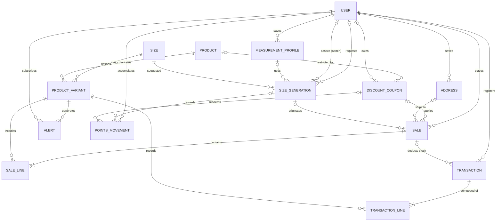

# Scan VKFit — Explicación punto a punto del modelo Entidad-Relación

> **Fuente:** `vkscanfit.pdf` (ERD), contrastado con `User_Journey.pdf` y `Scan_VKFit__Recorrido_de_la_experiencia.pdf`.
> **Convención de lectura:** `PK` = clave primaria · `FK` = clave foránea · `UK` = único · *nullable* = puede ser nulo.
> **Sobre las cardinalidades:** se deducen de las FK y de si son *nullable* (FK nullable ⇒ lado opcional). Conviene verificarlas contra los símbolos del diagrama original.

---

## 1. Visión general

El modelo tiene **15 entidades** agrupadas en seis dominios:

| Dominio | Entidades | Para qué sirve |
|---|---|---|
| **Identidad y contacto** | `USER`, `MEASUREMENT_PROFILE`, `ADDRESS` | Quién es la persona, con qué medidas y a dónde se le envía |
| **Talle** | `SIZE`, `SIZE_GENERATION` | La tabla de rangos por línea y cada recomendación generada |
| **Catálogo e inventario** | `PRODUCT`, `PRODUCT_VARIANT`, `TRANSACTION`, `TRANSACTION_LINE`, `ALERT` | Qué se vende, cuánto hay, cómo se mueve el stock y cuándo avisar |
| **Ventas** | `SALE`, `SALE_LINE` | Coordinaciones de compra y su detalle |
| **Gamificación** | `DISCOUNT_COUPON`, `POINTS_MOVEMENT` | Puntos por feedback y su canje por cupones |
| **Configuración** | `SETTING` | Parámetros de negocio editables |

### Diagrama de relaciones



`SETTING` no tiene relaciones: es una tabla clave-valor independiente.

---

## 2. Entidades, campo por campo

### 2.1 `USER` — Usuarios (clientes y administradores)

Una sola tabla para las dos personas del sistema. Coincide con el login unificado: el sistema reconoce internamente si es cliente o personal de Vikinga.

| Campo | Tipo | Restricción | Explicación |
|---|---|---|---|
| `id_user` | int | PK | Identificador |
| `type` | string | `Admin` \| `Customer` | Rol. Determina si ve el panel de administración o la experiencia de cliente |
| `name` | string | | Nombre |
| `email` | string | | Credencial de ingreso y canal de coordinación por defecto |
| `password_hash` | string | | Contraseña almacenada como hash (nunca en claro) |
| `whatsapp_phone` | string | | Teléfono obligatorio: es la vía para coordinar la entrega |
| `otp_code` | string | nullable | Código de un solo uso para ingresar sin contraseña; solo existe mientras hay un OTP activo |
| `otp_expires_at` | datetime | | Vencimiento del OTP |
| `points_balance` | int | | Saldo de puntos **denormalizado** (acumulado de `POINTS_MOVEMENT`) |
| `created_at` | datetime | | Alta |

**Relaciones:** es el nodo central del modelo. Tiene perfiles de medidas, direcciones, generaciones de talle, ventas, cupones, movimientos de puntos, alertas y transacciones de stock.

---

### 2.2 `MEASUREMENT_PROFILE` — Perfiles de medidas

Permite el **multi-perfil**: una persona guarda sus medidas y las de otros (p. ej. "Entrenamiento", "Hijo") y alterna entre ellos con el selector global.

| Campo | Tipo | Restricción | Explicación |
|---|---|---|---|
| `id_profile` | int | PK | |
| `id_user` | int | FK → `USER` | Dueño del perfil |
| `name` | string | | Nombre libre (ej. `Training`, `Son`) |
| `height`, `bust`, `waist`, `hip`, `torso` | decimal | | Las cinco medidas corporales |
| `is_default` | boolean | | Perfil precargado por defecto (debería haber uno solo por usuario) |

**Relaciones:** `USER 1—N MEASUREMENT_PROFILE` (*saves*). Un perfil puede estar referenciado por muchas `SIZE_GENERATION` (*uses*), lo que permite que **cada perfil tenga su historial por separado**.

---

### 2.3 `ADDRESS` — Agenda de direcciones

| Campo | Tipo | Restricción | Explicación |
|---|---|---|---|
| `id_address` | int | PK | |
| `id_user` | int | FK → `USER` | Dueño |
| `street`, `number`, `city`, `department` | string | | Dirección postal (`department` = departamento de Uruguay) |
| `reference` | string | | Indicaciones adicionales |
| `is_default` | boolean | | Dirección sugerida por defecto |

**Relaciones:** `USER 1—N ADDRESS` (*saves*) y `ADDRESS 0..1—N SALE` (*ships to*): una venta con envío a domicilio apunta a una dirección; con retiro en local, no.

---

### 2.4 `SIZE` — Tabla de talles y sus rangos

Reemplaza la tabla estática de medidas. Cada fila es un talle **de una línea** con el rango de medidas que cubre. Es la base del cálculo determinista.

| Campo | Tipo | Restricción | Explicación |
|---|---|---|---|
| `id_size` | int | PK | |
| `line` | string | `Endurance` \| `Soft` \| `Jammer` \| `Sunga` \| `Kids` | Línea de prenda a la que pertenece el talle |
| `code` | string | | Etiqueta visible (`S`, `M`, `L`, `8`, …) |
| `sort_order` | int | | Orden dentro de la línea; permite hallar los **talles adyacentes** (uno arriba / uno abajo) |
| `height_min/max`, `bust_min/max`, `waist_min/max`, `hip_min/max`, `torso_min/max` | decimal | | Rango de cada una de las cinco medidas que corresponde a este talle |

**Relaciones:** `SIZE 1—N PRODUCT_VARIANT` (*defines*: qué talle es cada variante) y `SIZE 1—N SIZE_GENERATION` (*suggested*: qué talle se recomendó).

---

### 2.5 `PRODUCT` — Producto (modelo)

Representa el modelo de prenda, sin color ni talle.

| Campo | Tipo | Restricción | Explicación |
|---|---|---|---|
| `id_product` | int | PK | |
| `line` | string | mismas 5 líneas | Línea a la que pertenece |
| `model` | string | | Nombre del modelo |
| `description` | string | | Descripción |
| `price` | decimal | | Precio base (el ER no define moneda; se asume UYU) |
| `active` | boolean | | Baja lógica: oculta el producto sin borrarlo |

**Relaciones:** `PRODUCT 1—N PRODUCT_VARIANT` (*has color+size*) y `PRODUCT 0..1—N DISCOUNT_COUPON` (*restricted to*: un cupón puede limitarse a un producto).

---

### 2.6 `PRODUCT_VARIANT` — Variante (Producto + Color + Talle)

Es la **unidad atómica de inventario**: el stock no se cuenta por "malla Endurance", sino por modelo + color + talle. Es lo que hace confiable el filtrado del catálogo.

| Campo | Tipo | Restricción | Explicación |
|---|---|---|---|
| `id_variant` | int | PK | |
| `id_product` | int | FK → `PRODUCT` | Modelo |
| `id_size` | int | FK → `SIZE` | Talle |
| `color` | string | | Color |
| `sku` | string | UK | Código único de la variante |
| `quantity` | int | | **Stock físico** (lo que hay realmente en el depósito) |
| `min_stock` | int | | Umbral mínimo; por debajo se dispara el stock crítico |
| `active` | boolean | | Baja lógica |

**Relaciones:** es el otro nodo central: se referencia desde `SALE_LINE` (*includes*), `TRANSACTION_LINE` (*records*) y `ALERT` (*generates*).

> **Nota:** el ER solo marca `sku` como único. La regla de negocio ("Producto + Color + Talle es único") conviene reforzarla con una restricción única compuesta `(id_product, color, id_size)`.

---

### 2.7 `SIZE_GENERATION` — Generación de talle

Registro de **cada recomendación** que el sistema calculó. Es la entidad que alimenta casi toda la analítica: conversión, precisión, demanda no satisfecha, historial y puntos.

| Campo | Tipo | Restricción | Explicación |
|---|---|---|---|
| `id_generation` | int | PK | |
| `id_customer` | int | FK → `USER`, nullable | Cliente que la pidió; nulo si fue invitado |
| `guest_session_id` | string | nullable | Identificador del invitado en el dispositivo; se usa para **migrar** los datos al registrarse |
| `id_profile` | int | FK → `MEASUREMENT_PROFILE`, nullable | Perfil de medidas usado, si lo hubo |
| `id_admin` | int | FK → `USER`, nullable | Admin que la generó en **modo asistente** ("Para terceros") |
| `line` | string | | Línea consultada |
| `created_at` | datetime | | Momento de la consulta |
| `height`, `bust`, `waist`, `hip`, `torso` | decimal | | **Copia** de las medidas usadas en ese momento (foto histórica; no cambia si el perfil se edita después) |
| `id_suggested_size` | int | FK → `SIZE` | Talle recomendado |
| `stock_available_at_query` | boolean | | Si al consultar había stock en ese talle. Base del **mapa de talles faltantes** |
| `rating` | string | `Small` \| `Correct` \| `Large`, nullable | Feedback del cliente sobre el calce (chico / correcto / grande) |
| `comment` | string | nullable | Comentario libre opcional |
| `rated_at` | datetime | | Momento del feedback |
| `fit_type` | string | `Training` \| `Competition` | Tipo de calce buscado |
| `source` | string | `Direct` \| `QR` \| `Landing` | Por dónde llegó el usuario (acceso directo, QR con deep link, landing informativa) |

**Relaciones:**
- Con `USER`: dos vínculos distintos. *requests* (`id_customer`, quien pide la recomendación) y *assists (admin)* (`id_admin`, quien la genera en nombre de otro).
- Con `MEASUREMENT_PROFILE` (*uses*), con `SIZE` (*suggested*).
- Con `SALE` (*originates*): una generación puede originar ventas; una venta puede tener o no generación asociada.
- Con `POINTS_MOVEMENT` (*rewards*): el feedback de una generación puede otorgar puntos.

**Reglas que se deducen:**
- Debe existir **al menos uno** entre `id_customer` y `guest_session_id` (o `id_admin` en modo asistente).
- El feedback vive dentro de la misma fila: por eso queda **desacoplado de la compra** y se admite una sola calificación por generación.

---

### 2.8 `SALE` — Venta (coordinación de compra)

Encabezado de una coordinación de compra. Nace en `PendingCoordination` cuando el cliente confirma, y recorre la máquina de estados manejada por el administrador.

| Campo | Tipo | Restricción | Explicación |
|---|---|---|---|
| `id_sale` | int | PK | |
| `id_user` | int | FK → `USER` | Cliente comprador (siempre registrado: el invitado no puede coordinar) |
| `id_coupon` | int | FK → `DISCOUNT_COUPON`, opcional | Cupón aplicado |
| `id_address` | int | FK → `ADDRESS`, nullable si retiro | Dirección de envío |
| `id_generation` | int | FK → `SIZE_GENERATION`, opcional | Recomendación que originó la compra; permite medir conversión y separar precisión "compró" vs "solo consultó" |
| `created_at` | datetime | | Alta |
| `status` | string | `PendingCoordination` \| `Contacted` \| `Confirmed` \| `Cancelled` | Estado (ver §4.2) |
| `channel` | string | `Email` \| `Whatsapp` | Canal de coordinación; **no cambia** durante el ciclo de vida |
| `delivery_method` | string | `StorePickup` \| `HomeDelivery` | Retiro en local o envío a domicilio |
| `contacted_at`, `confirmed_at`, `cancelled_at` | datetime | | Marcas de tiempo de cada transición |

**Relaciones:** `USER 1—N SALE` (*places*), `SALE 1—N SALE_LINE` (*contains*), `SALE 0..1—N TRANSACTION` (*deducts stock*), y con cupón, dirección y generación como se indicó.

---

### 2.9 `SALE_LINE` — Línea de venta

| Campo | Tipo | Restricción | Explicación |
|---|---|---|---|
| `id_sale_line` | int | PK | |
| `id_sale` | int | FK → `SALE` | Venta |
| `id_variant` | int | FK → `PRODUCT_VARIANT` | Variante pedida (producto + color + talle) |
| `quantity` | int | | Unidades |
| `unit_price` | decimal | | Precio unitario **congelado** al momento de la venta (no cambia si luego se actualiza el producto) |

**Importante:** mientras la venta está en `PendingCoordination` o `Contacted`, estas líneas son las que **reservan** stock (ver §4.3).

---

### 2.10 `DISCOUNT_COUPON` — Cupones de descuento

Cumple dos roles: **plantilla canjeable** (`points_cost` definido, sin dueño) y **cupón ya canjeado** (con `id_user` dueño).

| Campo | Tipo | Restricción | Explicación |
|---|---|---|---|
| `id_coupon` | int | PK | |
| `id_product` | int | FK → `PRODUCT`, opcional | Si existe, el cupón solo aplica a ese producto |
| `id_user` | int | FK → `USER`, opcional | Dueño, si fue canjeado |
| `coupon_code` | string | | Código a ingresar |
| `usage_count` | int | | Veces usado |
| `discount_type` | string | `Fixed` \| `Percentage` | Monto fijo o porcentaje |
| `discount_value` | decimal | | Valor del descuento |
| `max_discount` | decimal | | Tope del descuento (útil para porcentajes) |
| `points_cost` | int | nullable | Puntos necesarios para canjearlo |
| `valid_from`, `valid_until` | datetime | | Vigencia |
| `active` | boolean | | Habilitado / deshabilitado |

**Relaciones:** *restricted to* (`PRODUCT`), *owns* (`USER`), *applies* (`SALE`) y *redeems* (`POINTS_MOVEMENT`).

---

### 2.11 `TRANSACTION` — Movimiento de stock (cabecera)

Bitácora de auditoría del inventario. **No** es una venta: es un movimiento de mercadería con motivo obligatorio.

| Campo | Tipo | Restricción | Explicación |
|---|---|---|---|
| `id_transaction` | int | PK | |
| `id_user` | int | FK → `USER` | Quién lo registró |
| `id_sale` | int | FK → `SALE`, nullable | Presente solo si el movimiento es el descuento definitivo de una venta confirmada |
| `direction` | string | `Inbound` \| `Outbound` | Entrada o salida |
| `reason` | string | `GoodsReceipt` \| `SizeExchange` \| `LossDefective` \| `ManualAdjustment` \| `SaleConfirmed` | Motivo (ingreso de mercadería, cambio por talle, pérdida/defectuoso, ajuste manual, venta confirmada) |
| `created_at` | datetime | | Momento |

**Relaciones:** *registers* (`USER`), *deducts stock* (`SALE`), *composed of* (`TRANSACTION_LINE`).

---

### 2.12 `TRANSACTION_LINE` — Detalle del movimiento

| Campo | Tipo | Restricción | Explicación |
|---|---|---|---|
| `id_transaction_line` | int | PK | |
| `id_transaction` | int | FK → `TRANSACTION` | Cabecera |
| `id_variant` | int | FK → `PRODUCT_VARIANT` | Variante afectada |
| `quantity` | int | | Unidades movidas (el signo lo da `direction` de la cabecera) |

**Relación:** *records* con `PRODUCT_VARIANT`. Gracias a esta tabla se puede reconstruir **por qué** cambió el stock de una variante.

---

### 2.13 `ALERT` — Alertas de stock

Una sola tabla para dos tipos de alerta.

| Campo | Tipo | Restricción | Explicación |
|---|---|---|---|
| `id_alert` | int | PK | |
| `id_variant` | int | FK → `PRODUCT_VARIANT` | Variante a la que refiere |
| `id_user` | int | FK → `USER`, nullable | Solo en `RestockNotice`: el cliente suscripto |
| `alert_type` | string | `CriticalStock` \| `RestockNotice` | *CriticalStock*: aviso interno al admin cuando el stock cae bajo el mínimo. *RestockNotice*: aviso al cliente cuando vuelve a haber stock |
| `notification_mode` | string | | Modo de notificación (el ER no enumera valores) |
| `status` | string | `Active` \| `Notified` \| `Closed` | Ciclo de vida de la alerta |
| `created_at` | datetime | | Alta |

**Relaciones:** *generates* (`PRODUCT_VARIANT`) y *subscribes* (`USER`, opcional).

---

### 2.14 `POINTS_MOVEMENT` — Movimientos de puntos

Libro mayor de puntos: cada fila suma o resta. El saldo de `USER.points_balance` es su resultado acumulado.

| Campo | Tipo | Restricción | Explicación |
|---|---|---|---|
| `id_movement` | int | PK | |
| `id_user` | int | FK → `USER` | Dueño de los puntos |
| `id_generation` | int | FK → `SIZE_GENERATION`, nullable | Feedback que originó los puntos (tipo `Feedback`) |
| `id_coupon` | int | FK → `DISCOUNT_COUPON`, nullable | Cupón canjeado (tipo `Redemption`) |
| `points` | int | positivo o negativo | Positivo al ganar, negativo al canjear |
| `type` | string | `Feedback` \| `Redemption` \| `Adjustment` | Origen del movimiento |
| `created_at` | datetime | | Momento |

**Relaciones:** *accumulates* (`USER`), *rewards* (`SIZE_GENERATION`), *redeems* (`DISCOUNT_COUPON`).

---

### 2.15 `SETTING` — Configuración de reglas de negocio

Tabla clave-valor sin relaciones. Permite ajustar la economía de puntos **sin publicar una nueva versión**.

| Campo | Tipo | Restricción | Explicación |
|---|---|---|---|
| `key` | string | PK | Nombre del parámetro: `success_probability`, `points_per_feedback`, `max_daily_feedback`, … (el diagrama deja la lista abierta) |
| `value` | string | | Valor (siempre texto; se interpreta según la clave) |
| `updated_at` | datetime | | Última modificación |

---

## 3. Tabla completa de relaciones

| # | Etiqueta | Origen (1) | Destino (N) | FK | Opcionalidad | Significado |
|---|---|---|---|---|---|---|
| 1 | saves | `USER` | `MEASUREMENT_PROFILE` | `id_user` | obligatoria | Un usuario guarda varios perfiles de medidas |
| 2 | saves | `USER` | `ADDRESS` | `id_user` | obligatoria | Un usuario guarda varias direcciones |
| 3 | requests | `USER` | `SIZE_GENERATION` | `id_customer` | opcional (invitado) | El cliente pide recomendaciones de talle |
| 4 | assists (admin) | `USER` | `SIZE_GENERATION` | `id_admin` | opcional | El administrador genera recomendaciones para terceros |
| 5 | uses | `MEASUREMENT_PROFILE` | `SIZE_GENERATION` | `id_profile` | opcional | La generación puede partir de un perfil guardado |
| 6 | suggested | `SIZE` | `SIZE_GENERATION` | `id_suggested_size` | obligatoria | Talle recomendado por la generación |
| 7 | defines | `SIZE` | `PRODUCT_VARIANT` | `id_size` | obligatoria | El talle de cada variante |
| 8 | has color+size | `PRODUCT` | `PRODUCT_VARIANT` | `id_product` | obligatoria | Un producto se desglosa en variantes de color y talle |
| 9 | restricted to | `PRODUCT` | `DISCOUNT_COUPON` | `id_product` | opcional | Cupón limitado a un producto |
| 10 | owns | `USER` | `DISCOUNT_COUPON` | `id_user` | opcional | Dueño del cupón canjeado |
| 11 | places | `USER` | `SALE` | `id_user` | obligatoria | El cliente realiza ventas |
| 12 | applies | `DISCOUNT_COUPON` | `SALE` | `id_coupon` | opcional | Cupón aplicado a una venta |
| 13 | ships to | `ADDRESS` | `SALE` | `id_address` | opcional (retiro) | Dirección de envío |
| 14 | originates | `SIZE_GENERATION` | `SALE` | `id_generation` | opcional | La recomendación que originó la compra |
| 15 | contains | `SALE` | `SALE_LINE` | `id_sale` | obligatoria (≥1) | Detalle de la venta |
| 16 | includes | `PRODUCT_VARIANT` | `SALE_LINE` | `id_variant` | obligatoria | Variante vendida |
| 17 | registers | `USER` | `TRANSACTION` | `id_user` | obligatoria | Quién registra el movimiento de stock |
| 18 | deducts stock | `SALE` | `TRANSACTION` | `id_sale` | opcional | Movimiento generado al confirmar una venta |
| 19 | composed of | `TRANSACTION` | `TRANSACTION_LINE` | `id_transaction` | obligatoria (≥1) | Detalle del movimiento |
| 20 | records | `PRODUCT_VARIANT` | `TRANSACTION_LINE` | `id_variant` | obligatoria | Variante afectada |
| 21 | generates | `PRODUCT_VARIANT` | `ALERT` | `id_variant` | obligatoria | Alertas sobre una variante |
| 22 | subscribes | `USER` | `ALERT` | `id_user` | opcional | Cliente suscripto a un aviso de reposición |
| 23 | accumulates | `USER` | `POINTS_MOVEMENT` | `id_user` | obligatoria | Puntos ganados/gastados |
| 24 | rewards | `SIZE_GENERATION` | `POINTS_MOVEMENT` | `id_generation` | opcional | Feedback que otorgó puntos |
| 25 | redeems | `DISCOUNT_COUPON` | `POINTS_MOVEMENT` | `id_coupon` | opcional | Canje de puntos por el cupón |

---

## 4. Cómo se usa el modelo (flujos de negocio)

### 4.1 Generar un talle y luego comprar

1. La persona ingresa 5 medidas y una línea → se crea una `SIZE_GENERATION`. Se guardan las medidas (copia), `source` (Direct/QR/Landing) y `guest_session_id` si es invitada.
2. El sistema compara las medidas contra los rangos de `SIZE` de esa línea y guarda `id_suggested_size`.
3. Consulta `PRODUCT_VARIANT` para ese talle: guarda `stock_available_at_query` (true/false).
4. Si hay stock, el catálogo muestra las variantes disponibles. Si no, ofrece un aviso de reposición (`ALERT` tipo `RestockNotice`) o los talles adyacentes (se hallan con `SIZE.sort_order ± 1`).
5. Al registrarse, las generaciones con ese `guest_session_id` pasan a tener `id_customer`.
6. Al coordinar, se crea `SALE` (`PendingCoordination`) + `SALE_LINE`, con `id_generation` apuntando a la recomendación de origen.

### 4.2 Máquina de estados de `SALE`

```
PendingCoordination ──► Contacted ──► Confirmed
        │                   │
        └────────┬──────────┘
                 ▼
             Cancelled
```

| Estado | Efecto sobre el stock | Campo de fecha |
|---|---|---|
| `PendingCoordination` | Stock **reservado** (preventivo) | `created_at` |
| `Contacted` | Sigue reservado | `contacted_at` |
| `Confirmed` | Se crea `TRANSACTION` (`Outbound`, `SaleConfirmed`, con `id_sale`) y se descuenta `quantity` físico | `confirmed_at` |
| `Cancelled` | La reserva se libera al instante; no hace falta movimiento de stock | `cancelled_at` |

### 4.3 Reserva y disponibilidad de stock

El ER **no tiene una columna de "stock reservado"**. Por lo tanto la reserva es derivada:

- `reservado(variante)` = suma de `SALE_LINE.quantity` de ventas en `PendingCoordination` o `Contacted`.
- `disponible(variante)` = `quantity − reservado`.
- Stock crítico = `disponible < min_stock` → base de las alertas `CriticalStock` y del dashboard.

### 4.4 Ajustes manuales de inventario

Cada ajuste crea una `TRANSACTION` con `reason` obligatorio (`GoodsReceipt`, `SizeExchange`, `LossDefective`, `ManualAdjustment`) y una o más `TRANSACTION_LINE`. Al reponer una variante que estaba en 0, las `ALERT` `RestockNotice` activas de esa variante pasan a `Notified`.

### 4.5 Feedback, puntos y cupones

1. El cliente califica (`rating` + `comment` opcional) sobre la `SIZE_GENERATION` — sin necesidad de compra.
2. Se sortea según `SETTING.success_probability` y se respeta `SETTING.max_daily_feedback`. Si acierta, se crea `POINTS_MOVEMENT` (`Feedback`, `points > 0`, `id_generation`) y sube `USER.points_balance` en `SETTING.points_per_feedback`.
3. Para canjear: se elige un `DISCOUNT_COUPON` con `points_cost`; se crea `POINTS_MOVEMENT` (`Redemption`, `points < 0`, `id_coupon`) y el cupón queda con `id_user` dueño.
4. El cupón se aplica en una `SALE.id_coupon`.

### 4.6 Modo asistente ("Para terceros")

Un admin genera un `SIZE_GENERATION` con `id_admin` completo. Ese registro no debe contaminar las métricas ni el historial personales del admin; opcionalmente se vincula a un cliente registrado (`id_customer`).

### 4.7 Indicadores del dashboard y a qué campos responden

| Indicador | Cómo se calcula con el ER |
|---|---|
| **Conversión** | Cantidad de `SALE` (por `id_generation`) vs. cantidad de `SIZE_GENERATION` |
| **Precisión** | % de `SIZE_GENERATION.rating = 'Correct'`, separado entre generaciones con `SALE` asociada y sin ella |
| **Stock crítico** | `PRODUCT_VARIANT` con `disponible < min_stock` |
| **Ventas en vuelo** | `SALE` en `PendingCoordination`/`Contacted`, con `channel`, `delivery_method` y `USER.whatsapp_phone` |
| **Mapa de talles faltantes** | `SIZE_GENERATION` con `stock_available_at_query = false`, agrupado por línea y talle |
| **Análisis de comentarios** | `SIZE_GENERATION.comment` filtrado por `rating`, línea y fecha |

---

## 5. Observaciones y puntos a validar del modelo

| # | Observación | Por qué importa | Sugerencia |
|---|---|---|---|
| 1 | **No hay entidad de reserva.** La documentación dice que al coordinar "se genera un `id_transacción` y un `id_venta`", pero `TRANSACTION` es un movimiento de stock (`SaleConfirmed`). | Ambigüedad sobre cuándo nace la transacción | Confirmar que la reserva es derivada y que la transacción de stock se crea recién al confirmar |
| 2 | **`SALE` no tiene total ni descuento calculado.** Solo hay precios por línea y `id_coupon`. | El total y el descuento deben recalcularse siempre | Definir si se persiste `total`/`discount_amount` para congelar el histórico |
| 3 | **`ALERT` referencia una variante**, pero el aviso de reposición se pide por "talle sin stock en ningún color de la línea". | Una suscripción implica varias alertas | Crear una alerta por variante o modelar la suscripción por `(línea, talle)` |
| 4 | **`SIZE_GENERATION` no guarda color**, pero el mapa de faltantes habla de "talle o color". | El reporte solo puede ser por línea × talle | Decidir si el color entra en el reporte y, en tal caso, dónde se registra |
| 5 | **`fit_type` (Training/Competition)** existe en el ER pero no aparece en ningún recorrido. | Falta la regla que lo usa en el cálculo | Definir su efecto en el talle o eliminarlo |
| 6 | **`TRANSACTION` tiene una sola `direction`.** Un cambio por talle implica una entrada y una salida. | Un `SizeExchange` no cabe en una cabecera | Usar dos transacciones enlazadas o mover la dirección a la línea |
| 7 | **`DISCOUNT_COUPON` mezcla plantilla y cupón poseído.** | Al canjear ¿se copia o se asigna el mismo registro? Puede quedar duplicado el `coupon_code` | Separar plantilla (`COUPON_TEMPLATE`) de cupón emitido, o definir explícitamente la copia |
| 8 | **`usage_count` y `max_discount` sin regla documentada.** | No está claro si hay límite de usos ni cómo aplica el tope | Agregar `max_uses` y documentar el cálculo |
| 9 | **`points_balance` está denormalizado.** | Puede desincronizarse de `POINTS_MOVEMENT` | Actualizarlo siempre en la misma transacción de BD, o calcularlo como suma |
| 10 | **`guest_session_id` no tiene tabla propia.** Es un string suelto. | La migración depende de que coincida exactamente | Aceptable; garantizar unicidad y un índice |
| 11 | **Unicidad de variante:** solo `sku` es `UK`. | Podrían duplicarse combinaciones producto + color + talle | Agregar restricción única `(id_product, color, id_size)` |
| 12 | **`rated_at` y `otp_expires_at` no están marcados como nullable** aunque solo aplican en ciertos casos. | Datos inválidos si se exige no nulo | Marcarlos como *nullable* |
| 13 | **`line` está duplicada** en `SIZE` y `PRODUCT` (string en ambas). | Riesgo de inconsistencias de texto | Usar una tabla/enum común de líneas |
| 14 | **Sin vencimiento de reservas.** Una venta abandonada retiene stock indefinidamente. | Impacto operativo directo | Definir un TTL o recordatorio automático |
| 15 | **Unicidad de perfil/dirección por defecto** (`is_default`) no está forzada por el modelo. | Podrían existir varios "por defecto" | Restricción a nivel de aplicación o índice único parcial |

---

## 6. Glosario de valores enumerados

| Campo | Valores | Significado |
|---|---|---|
| `USER.type` | `Admin`, `Customer` | Personal de Vikinga / cliente |
| `*.line` | `Endurance`, `Soft`, `Jammer`, `Sunga`, `Kids` | Líneas de prenda (`Kids` = Infantil) |
| `SIZE_GENERATION.rating` | `Small`, `Correct`, `Large` | Chico, correcto, grande |
| `SIZE_GENERATION.fit_type` | `Training`, `Competition` | Calce de entrenamiento / competencia |
| `SIZE_GENERATION.source` | `Direct`, `QR`, `Landing` | Origen de la consulta |
| `SALE.status` | `PendingCoordination`, `Contacted`, `Confirmed`, `Cancelled` | Pendiente de coordinación, contactado, confirmada, cancelada |
| `SALE.channel` | `Email`, `Whatsapp` | Canal de coordinación |
| `SALE.delivery_method` | `StorePickup`, `HomeDelivery` | Retiro en local / envío a domicilio |
| `TRANSACTION.direction` | `Inbound`, `Outbound` | Entrada / salida de stock |
| `TRANSACTION.reason` | `GoodsReceipt`, `SizeExchange`, `LossDefective`, `ManualAdjustment`, `SaleConfirmed` | Ingreso de mercadería, cambio por talle, pérdida/defectuoso, ajuste manual, venta confirmada |
| `ALERT.alert_type` | `CriticalStock`, `RestockNotice` | Stock crítico (admin) / aviso de reposición (cliente) |
| `ALERT.status` | `Active`, `Notified`, `Closed` | Activa, notificada, cerrada |
| `DISCOUNT_COUPON.discount_type` | `Fixed`, `Percentage` | Monto fijo / porcentaje |
| `POINTS_MOVEMENT.type` | `Feedback`, `Redemption`, `Adjustment` | Ganancia por feedback, canje, ajuste manual |
